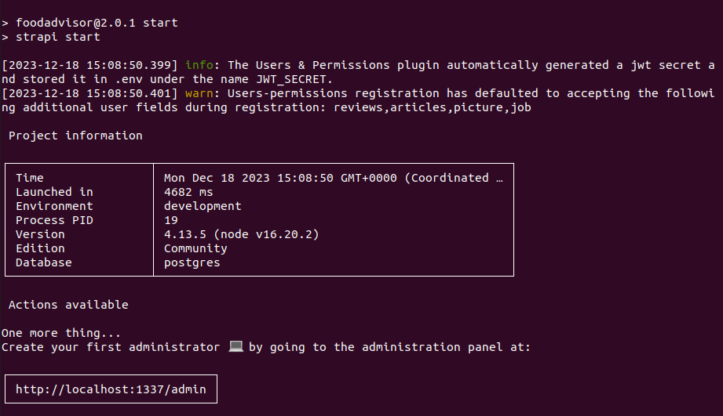
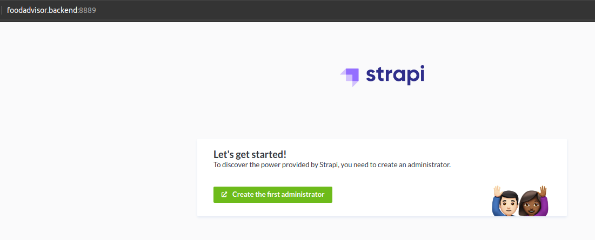
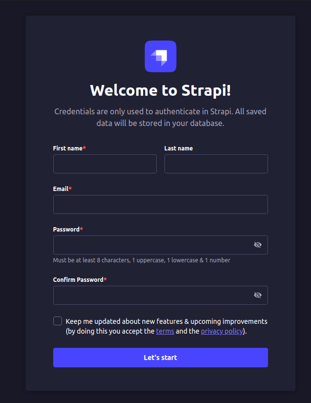
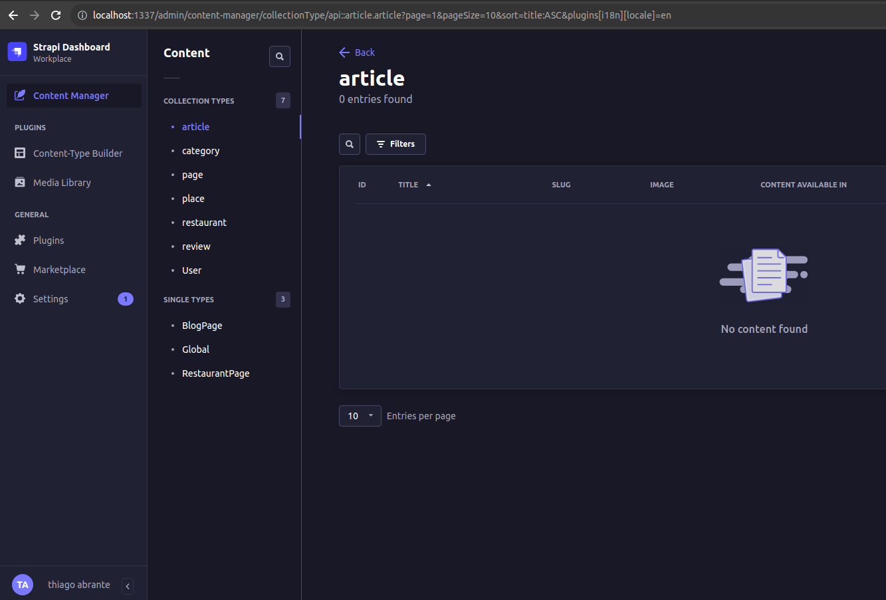
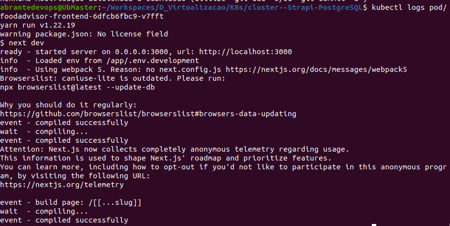

<h1 align="center"> Cluster k8s Strapi-Nextjs-PostgreSQL</h1>

<p align="justify">Neste projeto o objetivo consiste em provisionar uma aplicação web que tem backend, frontend e banco de dados. Para isso, foi utilizado o <a href="https://helm.sh/">Helm chart</a> para auxiliar na implantação em um cluster k8s.</p>

<h2 id="stack">Technologies stack</h2>

<h3>Backend</h3>
<p align="justify">O backend é implementado através do Strapi, que compreende basicamente uma plataforma de conteúdo headless que permite criar APIs e aplicações web baseadas em conteúdo. </p>

<h3>Frontend</h3>
<p align="justify">O frontend é criado usando Next.js, sendo um framework React com renderização híbrida estática e de servidor, bem como suporte a TypeScript.</p>

<h3>Banco de dados</h3>
<p align="justify">O Postgres é usado para armazenar os dados da aplicação. Há uma versão deste projeto que emprega o sqlite como exemplo de banco de dados. No entanto, para fins de requisito, foi feita a integração com o Postgres. A versão que utiliza o sqlite pode ser encontrada na Branch <a href="#">sqlite</a> deste repositório.</p>

<h3>Aplicação</h3>
<p align="justify">Para a aplicação o <a href="https://github.com/strapi/foodadvisor.git">Food Advisor</a> foi utilizado como base para o projeto. </p>

<h2 id="k8s">Kubernetes</h2>

<h3>Recursos</h3>

<p align="justify">Os recursos do Kubernetes necessários para o projeto são:

<p align="justify">Para o Strapi:

- Dois pods: um para api e outro para o client;
- Dois serviços: um para api e outro para o client;
- Um secret para guardar as credenciais de conexão da api com o banco;
- Dois deployment: um para api e outro para o client;
- Dois ingress: um para api e outro para o client

<p align="justify"> Para o Postgres:<p>

- Bitnami Chart Postgres: https://github.com/bitnami/charts/tree/main/bitnami/postgresql

<h3>Arquitetura</h3>


<h2 id="act">Metodologia</h2>

<p align="justify">O chart Helm foi configurado para usar as imagens Docker criadas para o Frontend e Backend. Também foi configurada a dependência do chart para o Postgres, bem como as variáveis de ambientes necessárias para fazer a conexão da api com o postgres. Pode-se encontrar a definição dessa variáveis aqui: https://github.com/strapi/foodadvisor/blob/master/api/config/database.js

<h3>Pré-requisitos</h3>

<p align="justify">Ponto Importante: O projeto foi testado em um ambiente local com o Minikube mediante o driver de hipervisor Docker, caso opte por usar outro driver, esteja seguro que conhece bem o gerenciador de pacotes, sistema de arquivos e comandos que sejam necessários para resolver eventuais imprevistos que possam ocorrer na sua opção, você será responsável pelo troubleshooting do Minikube. Se você não está totalmente seguro, sinta-se a vontade para configurar o Minikube com o driver Docker da seguinte forma:</p>
  
```bash
# Certifique-se que o Docker está instalado e rodando corretamente.
# Após instalar o Minikube, execute os comandos abaixo:
minikube config set driver docker
minikube start
```

<p align="justify">Para garantir que o projeto funcione na versão local, é necessário adicionar no arquivo /etc/hosts (ou equivalente em um sistema operacional não baseado em Linux) o seguinte PATH do Ingress: </p>
  
```bash
127.0.0.1  foodadvisor.client  foodadvisor.backend
```

<h3>Procedimentos</h3>

1. Para habilitar o controlador NGINX Ingress, execute o seguinte comando: `minikube addons enable ingress`
2. Realize o clone deste repositório e entre na release do projeto: `git clone https://github.com/abrantedevops/proj-cluster---k8s-helm.git ; cd proj-cluster---k8s-helm/strapi-foodadvisor`
3. Atualize as dependências e retorne ao diretório raiz com o comando: `helm dependency update ; cd ..`
4. No diretório raiz, implemente a aplicação através do seguinte comando: `helm upgrade strapi-foodadvisor ./strapi-foodadvisor --install`
5. Para verificar se a aplicação foi implementada com sucesso, execute o seguinte comando: `kubectl get all`
6. Caso queira excluir a aplicação, execute o seguinte comando: `helm uninstall strapi-foodadvisor`

<h2 id="test">Testes</h2>

<h3>Redirecionamentos</h3>

- Para os testes seguintes foi feito um port-forward para o service do ingress-controller da seguinte forma: `kubectl port-forward svc/ingress-nginx-controller 8889:80 -n ingress-nginx`

- Para acessar o painel de administração, utilize o comando: `kubectl port-forward svc/foodadvisor-backend 1337:80`

<h3>Recursos</h3>

O primeiro teste consistiu em verificar os recursos criados no cluster k8s. Por meio de um um alias feito da seguinte forma: `alias kgetall='kubectl get pod,svc,secret,deployment,ingress,replicaset'` foi possivel verificar o funcionamento de todos os recursos do cluster conforme os requisitos do projeto.


<br> 

<h3>Backend</h3>

<p align="justify"> Analisando o log do Pod do backend levantando no cluster, foi possível verificar que a conexão com o banco de dados foi estabelecida com êxito.</p>



<br>

<p align="justify">Verifique no endereço http://foodadvisor.backend:8889/ o funcionamento do Strapi para a criação da conta de administrador, conforme a imagem abaixo.</p>



<br>

<p align="justify">Isso ocorre porque estamos usando um banco de dados novo, sem nenhuma informação previamente armazenada, diferente do que ocorre na versão "nativa" do Food Advisor que utiliza o arquivo data.zip para popular o banco de dados sqlite, tal como consta no arquivo "database.js" da api.</p>

<p align="justify">Acesse o endereço http://localhost:1337/admin para criar a conta de administrador informando os dados solicitados, após isso o painel do Strapi será exibido.</p>






<h3>Frontend</h3>

<p align="justify">No Pod do frontend a compilação foi bem sucedida, conforme imagem abaixo.</p>


<br>
<p align="justify">Ao Acessar o endereço http://foodadvisor.client:8889/ encontramos o código de status 404, pois como o banco de dados está vazio, não há nenhuma informação para ser exibida.</p>

<h3>Banco de dados</h3>

<p align="justify"> Para verificar o funcionamento do banco de dados foi feito um port-forward para o service do strapi-foodadvisor-postgresql, sem seguida usando as conexão estabelecidas anteriormente foi possível acessar o banco de dados.</p>

```bash
kubectl port-forward svc/strapi-foodadvisor-postgresql 5433:5432
psql -h localhost -p 5433 -U strapi -d strapi
password: strapi
```

<h2 id="info">Informações Complementares</h2>

Versões utilizadas:
  - Helm: 3.13.2;
  - Strapi: 4.13.5;
  - Postgres: 16.1;
  - Minikube: 1.31.2;
  - Kubectl: 1.28.4;
  - Linux Ubuntu: 20.04.6 LTS
