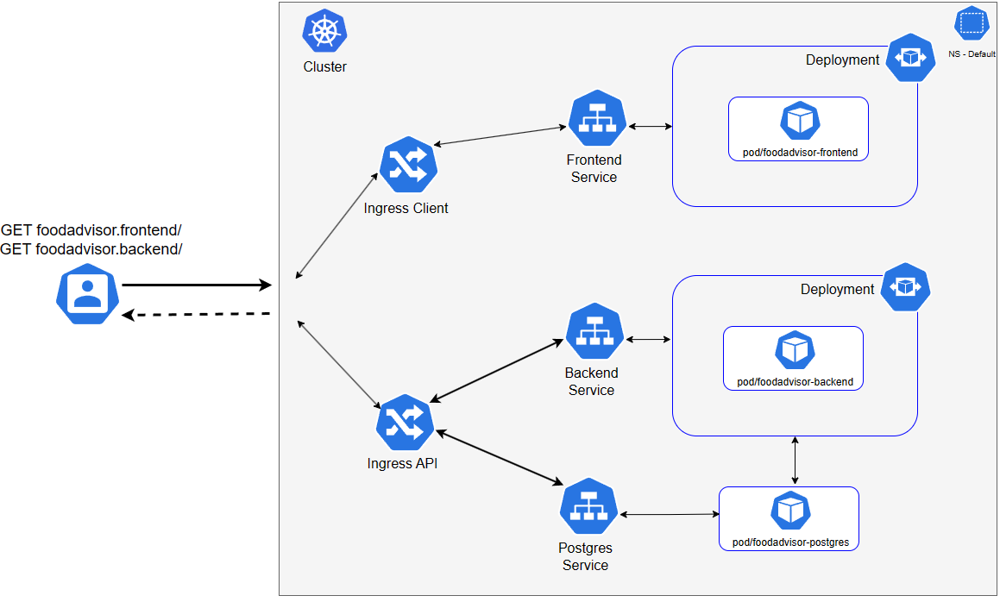
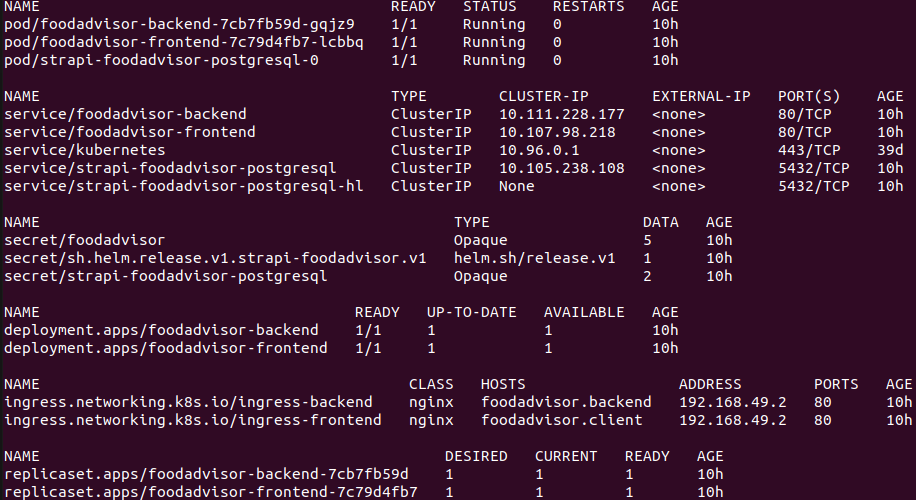
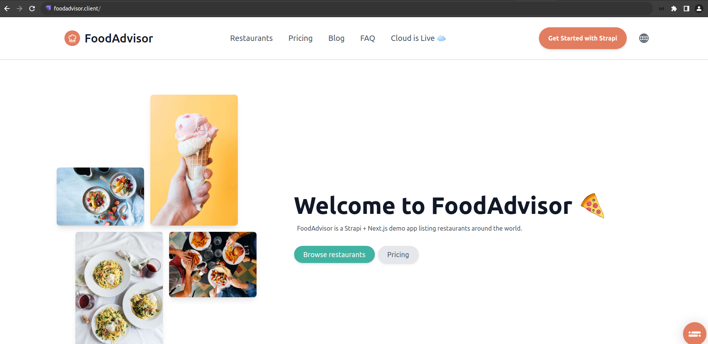
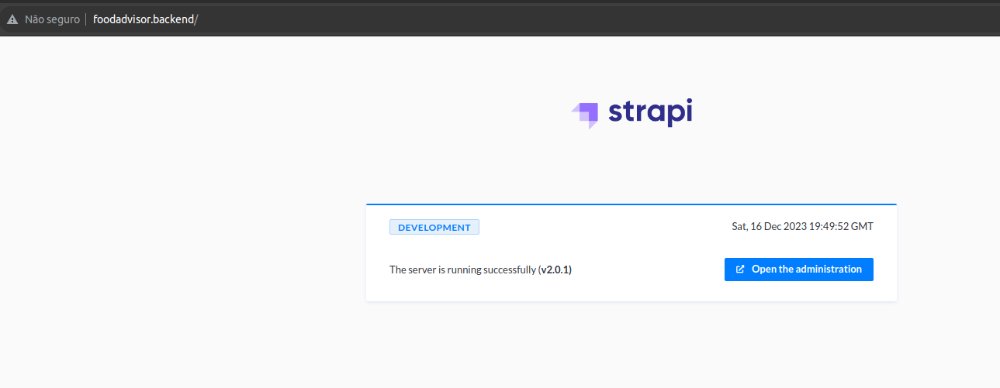
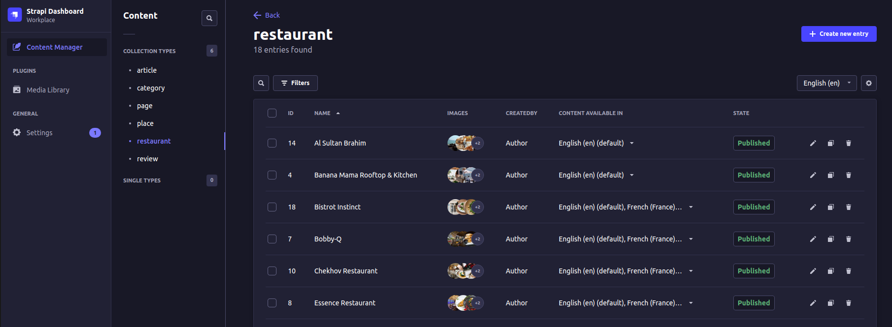

<h1 align="center"> Cluster k8s Strapi-Nextjs-PostgreSQL</h1>

<p align="justify">Neste projeto o objetivo consiste em provisionar uma aplicação web que tem backend, frontend e banco de dados. Para isso, foi utilizado o <a href="https://helm.sh/">Helm chart</a> para auxiliar na implantação em um cluster k8s.</p>

<h2 id="stack">Technologies stack</h2>

<h3>Backend</h3>
<p align="justify">O backend é implementado através do Strapi, que compreende basicamente uma plataforma de conteúdo headless que permite criar APIs e aplicações web baseadas em conteúdo. </p>

<h3>Frontend</h3>
<p align="justify">O frontend é criado usando Next.js, sendo um framework React com renderização híbrida estática e de servidor, bem como suporte a TypeScript.</p>

<h3>Banco de dados</h3>
<p align="justify">O Postgres é usado como banco de dados para armazenar os dados da aplicação.</p>

<h3>Aplicação</h3>
<p align="justify">Para a aplicação o <a href="https://github.com/strapi/foodadvisor.git">Food Advisor</a> foi utilizado como base para o projeto. </p>

<h2 id="k8s">Kubernetes</h2>

<h3>Recursos</h3>

<p align="justify">Os recursos do Kubernetes necessários para o projeto são:

<p align="justify">Para o Strapi:

- Dois pods: um para api e outro para o client;
- Dois serviços: um para api e outro para o client;
- Um secret para guardar as credenciais de conexão da api com o banco;
- Dois deployment: um para api e outro para o client;
- Dois ingress: um para api e outro para o client

<p align="justify"> Para o Postgres:<p>

- Bitnami Chart Postgres: https://github.com/bitnami/charts/tree/main/bitnami/postgresql

<h3>Arquitetura</h3>


<h2 id="act">Metodologia</h2>

<p align="justify">O chart Helm foi configurado para usar as imagens Docker criadas para o Frontend e Backend. Também foi configurada a dependência do chart para o Postgres, bem como as variáveis de ambientes necessárias para fazer a conexão da api com o postgres. Pode-se encontrar a definição dessa variáveis aqui: https://github.com/strapi/foodadvisor/blob/master/api/config/database.js

<h3>Pré-requisitos</h3>

<p align="justify">Ponto Importe: O projeto foi testado em um ambiente local com o Minikube mediante o driver de hipervisor Docker, caso opte por usar outro driver, esteja seguro que conhece bem o gerenciador de pacotes, sistema de arquivos e comandos que sejam necessários para resolver eventuais imprevistos que possam ocorrer na sua opção, você será responsável pelo troubleshooting do Minikube. Se você não está totalmente seguro, sinta-se a vontade para configurar o Minikube com o driver Docker da seguinte forma:</p>
  
```bash
# Certifique-se que o Docker está instalado e rodando corretamente.
# Após instalar o Minikube, execute os comandos abaixo:
minikube config set driver docker
minikube start
```

<p align="justify">Para garantir que o projeto funcione na versão local, é necessário adicionar o IP do Minikube no arquivo /etc/hosts (ou equivalente em um sistema operacional não baseado em Linux): </p>
  
```bash
minikube ip
192.168.49.2

# Adicione a linha abaixo no arquivo /etc/hosts
192.168.49.2  foodadvisor.client  foodadvisor.backend
```

<h3>Procedimentos</h3>

1. Para habilitar o controlador NGINX Ingress, execute o seguinte comando: `minikube addons enable ingress`
2. Realize o clone deste repositório e entre na release do projeto: `git clone https://github.com/abrantedevops/strapi-nextjs-postgres.git ; cd strapi-nextjs-postgres/strapi-foodadvisor`
3. Atualize as dependências e retorne ao diretório raiz com o comando: `helm dependency update ; cd ..`
4. No diretório raiz, implemente a aplicação através do seguinte comando: `helm upgrade strapi-foodadvisor ./strapi-foodadvisor --install`
5. Para verificar se a aplicação foi implementada com sucesso, execute o seguinte comando: `kubectl get all`
6. Caso queira excluir a aplicação, execute o seguinte comando: `helm uninstall strapi-foodadvisor`

<h2 id="test">Testes</h2>

<h3>Recursos</h3>

O primeiro teste consistiu em verificar os recursos criados no cluster k8s. Por meio de um um alias feito da seguinte forma: `alias kgetall='kubectl get pod,svc,secret,deployment,ingress,replicaset'` foi possivel verificar o funcionamento de todos os recursos do cluster conforme os requisitos do projeto.



<h3>Frontend</h3>

<p align="justify">Acesse o endereço http://foodadvisor.client/ e verifique a aplicação Food Advisor.</p>


<h3>Backend</h3>

<p align="justify">- Verifique no endereço http://foodadvisor.backend/ o funcionamento do Strapi. </p>
<p align="justify">- Para acessar o painel de administração, utilize o comando: `kubectl port-forward svc/foodadvisor-backend 1337:80`</p>
<p align="justify">- Acesse o endereço http://localhost:1337 e use as credenciais da aplicação</p>

<br><br>


<h3>Banco de dados</h3>

<p align="justify"> Para verificar o funcionamento do banco de dados foi feito um port-forward para o service do strapi-foodadvisor-postgresql, sem seguida usando as conexão estabelecidas anteriormente foi possível acessar o banco de dados.</p>

```bash
kubectl port-forward svc/strapi-foodadvisor-postgresql 5433:5432
psql -h localhost -p 5433 -U strapi -d strapi
password: strapi
```

<h2 id="info">Informações Complementares</h2>

Versões utilizadas:
  - Helm: 3.13.2;
  - Strapi: 4.13.5;
  - Postgres: 16.1;
  - Minikube: 1.31.2;
  - Kubectl: 1.28.4
